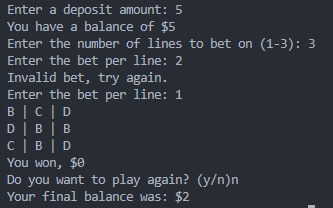

# 🎰 CasinoSlot

A simple Node.js command-line slot machine game. Spin the reels, test your luck, and see if you can hit the jackpot!



---

## 📦 Project Overview
CasinoSlot is a lightweight CLI-based slot machine game built with Node.js.  
It uses text-based input/output for an interactive experience right in your terminal.

---

## 🚀 Features
- 🎲 Random slot spins with symbols.
- 🪙 Simple betting system.
- 🏆 Winning detection and payouts.
- ⌨️ User input via CLI (using `prompt-sync`).
- ⚡ Quick setup and play.

---

## 🛠️ Installation

1. Clone this repository:
   ```bash
   git clone https://github.com/yourusername/CasinoSlot.git
   cd CasinoSlot
   ```

2. Install dependencies:
   ```bash
   npm install
   ```

---

## ▶️ Usage

Run the game with:
```bash
node project.js
```

Follow the on-screen prompts to spin the slot machine and play.

---

## 📂 Project Structure
```plaintext
CasinoSlot/
├── project.js          # Main game logic
├── package.json        # Dependencies and project metadata
├── images/             # Screenshot folder
│   └── casinoslot.png
└── node_modules/       # Installed packages
```

---

## ⚙️ Dependencies
- [prompt-sync](https://www.npmjs.com/package/prompt-sync) – for user input in the terminal  
- [init](https://www.npmjs.com/package/init) – project initialization helper  

---

## 🧑‍💻 Author
- Bryan M.

---

## 📜 License
- This project is licensed under the [ISC License](LICENSE).  
